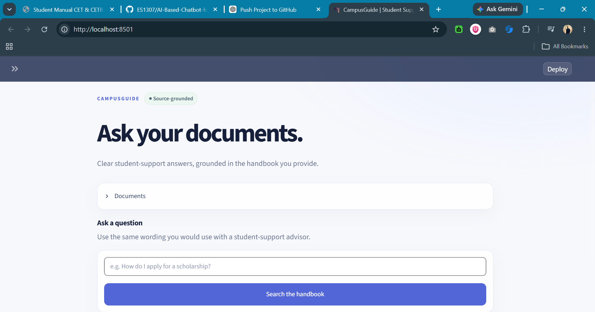
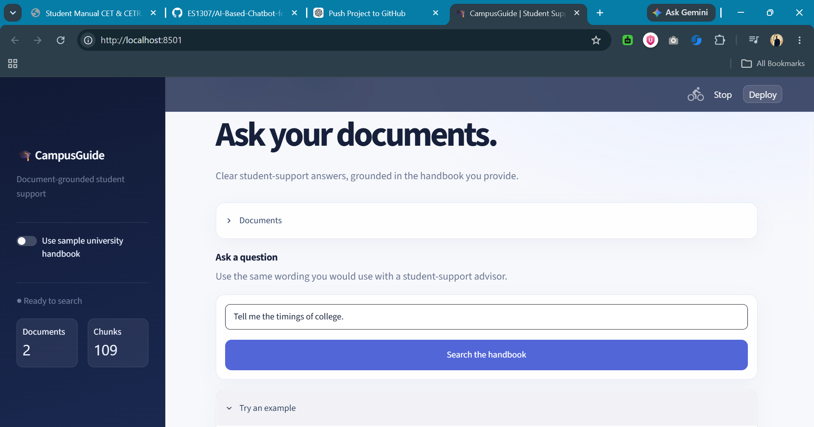
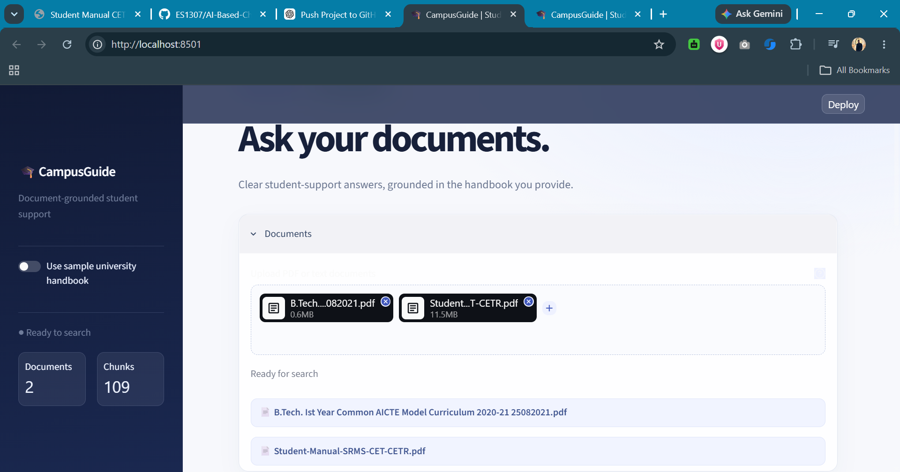
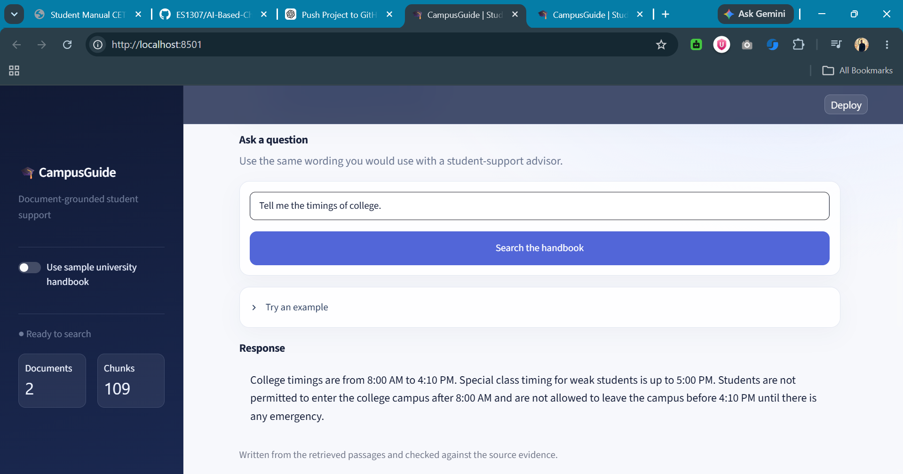
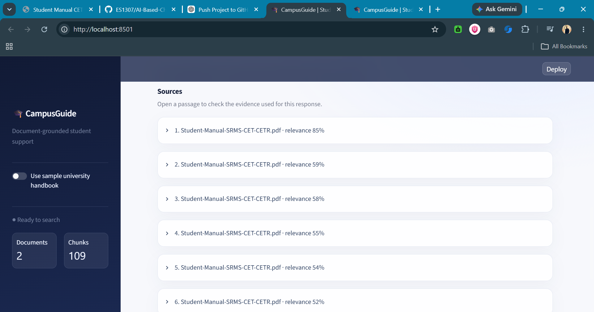

# 🎓 AI-Based Chatbot for Student Services
[](https://es1307-ai-based-chatbot-for-student-services-app-u8xe19.streamlit.app/)    

> **IBM Project-Based Experiential Learning (PBEL) 2026**

An AI-powered **Retrieval-Augmented Generation (RAG)** chatbot that helps students quickly find information from official university documents using semantic search and a **Qwen Large Language Model**.

Unlike traditional chatbots that rely solely on pretrained knowledge, this application retrieves the most relevant information from uploaded university documents before generating a response, making answers accurate, explainable, and trustworthy.

---

## 🚀 Live Demo

🌐 **Try the application here**

### https://es1307-ai-based-chatbot-for-student-services-app-u8xe19.streamlit.app/

No installation required. Simply open the application, upload university documents, and start asking questions.

---

# ✨ Features

- 📄 Upload multiple PDF and TXT documents
- 🤖 Retrieval-Augmented Generation (RAG)
- 🧠 Semantic Search using Sentence Transformers
- 💬 AI-generated responses using **Qwen**
- 📚 Source-grounded responses
- 🔍 Retrieved evidence with similarity scores
- ⚡ Automatic fallback to retrieved context
- 📂 Multi-document support
- 🎨 Modern Streamlit interface
- 🔎 Explainable AI with retrieved source passages

---

# 🏗️ System Architecture

```text
                    Student Question
                           │
                           ▼
                Sentence Embedding Model
                           │
                           ▼
                  Semantic Vector Search
                           │
                           ▼
            Most Relevant Document Chunks
                           │
                           ▼
         Prompt Construction using Context
                           │
                           ▼
                  Qwen Language Model
                           │
                           ▼
              AI Generated Grounded Answer
                           │
                           ▼
         Source Evidence + Similarity Scores
```

---

# 🛠️ Tech Stack

| Category | Technology |
|-----------|------------|
| Language | Python |
| Frontend | Streamlit |
| LLM | Qwen |
| Embedding Model | all-MiniLM-L6-v2 |
| NLP | Sentence Transformers |
| Similarity Search | Cosine Similarity |
| Document Processing | PyPDF2 |
| AI Technique | Retrieval-Augmented Generation (RAG) |

---

# 📂 Project Structure

```text
AI-Based-Chatbot-for-Student-Services
│
├── app.py
├── rag_engine.py
├── requirements.txt
├── README.md
│
├── images
│   ├── Home.png
│   ├── Chat_Interface.png
│   ├── Retrieval_context.png
│   ├── Generated_output.png
│   └── Source_evidence.png
│
└── sample_documents
    ├── Student Manual.pdf 
    ├── AICTE Curriculum.pdf 
    └── University Handbook.tx
```

---

# ⚙️ Installation

Clone the repository

```bash
git clone https://github.com/ES1307/AI-Based-Chatbot-for-Student-Services.git
```

Move into the project

```bash
cd AI-Based-Chatbot-for-Student-Services
```

Create a virtual environment

```bash
python -m venv .venv
```

Activate it (Windows)

```bash
.venv\Scripts\activate
```

Install dependencies

```bash
pip install -r requirements.txt
```

Run the application

```bash
streamlit run app.py
```

---

# 💡 Example Questions

- What are the college timings?
- What is the attendance requirement?
- How can I apply for scholarships?
- What are the examination rules?
- What are the library timings?
- What student support services are available?

---

# 🔄 RAG Workflow

1. Upload university documents.
2. Extract text from PDFs and TXT files.
3. Split the documents into semantic chunks.
4. Generate embeddings using Sentence Transformers.
5. Convert the user query into an embedding.
6. Retrieve the most relevant document chunks.
7. Construct a grounded prompt.
8. Generate the final response using **Qwen**.
9. Display retrieved evidence with similarity scores.

---

# 📸 Screenshots

## 🏠 Home Page

Landing page of CampusGuide.



---

## 💬 Chat Interface

Students can ask questions in natural language.



---

## 📂 Retrieval Context

Uploaded university documents are indexed and made searchable.



---

## 🤖 AI Generated Response

Grounded answer generated using the retrieved document context and Qwen.



---

## 📚 Source Evidence

Retrieved passages with relevance scores for transparency and explainability.



---

# 🎯 Learning Outcomes

This project demonstrates practical understanding of:

- Retrieval-Augmented Generation (RAG)
- Semantic Search
- Vector Embeddings
- Prompt Engineering
- Large Language Models (LLMs)
- Explainable AI
- Information Retrieval
- Responsible AI

---

# 🚀 Future Improvements

- FAISS / ChromaDB vector database
- Conversation memory
- OCR support for scanned PDFs
- Voice interaction
- Multi-language support
- User authentication
- REST API
- Cloud deployment with Docker
- Citation highlighting inside PDFs

---

# 📄 Dataset

The chatbot retrieves information from official university documents such as:

- Student Manual
- AICTE Curriculum
- University Academic Documents

These documents are indexed at runtime to generate grounded responses.

---

# ⚠️ Disclaimer

Responses are generated only from the uploaded documents.

Users should verify important academic information using the latest official university notifications before making decisions.

---

# 👨‍💻 Author

**Eshaan Sabharwal**

B.Tech – Computer Science & Engineering

Shri Ram Murti Smarak College of Engineering & Technology

IBM Project-Based Experiential Learning (PBEL)

---

## ⭐ Support

If you found this project useful, please consider giving it a ⭐ on GitHub.
