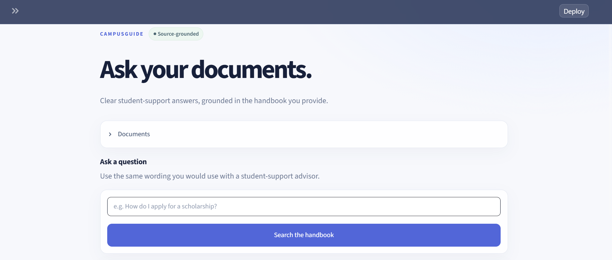
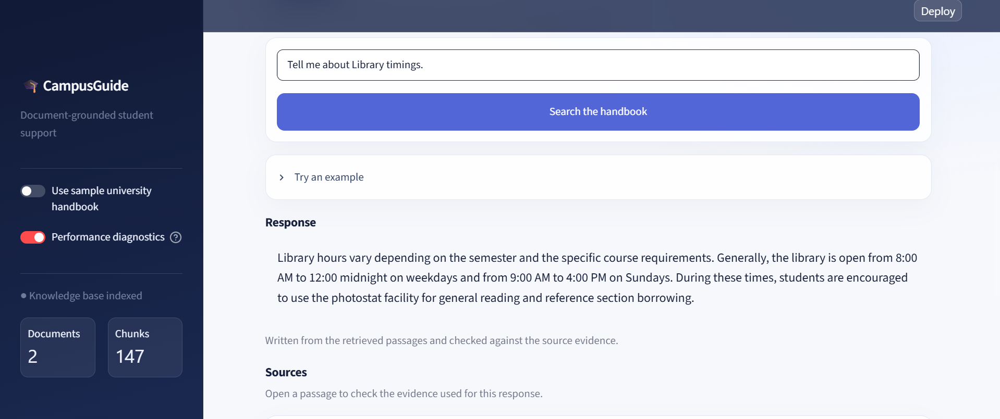
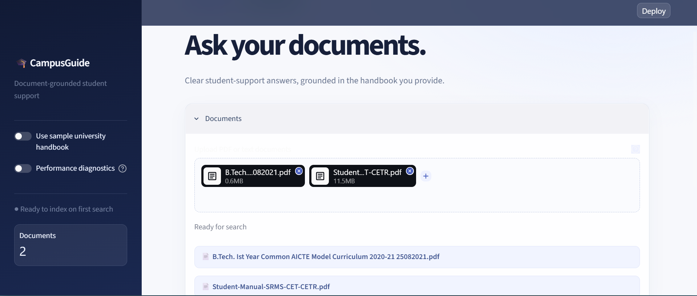
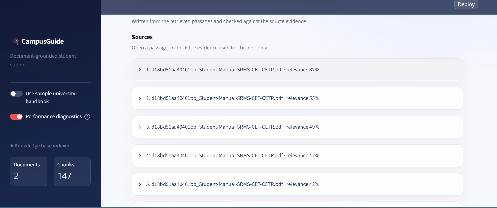
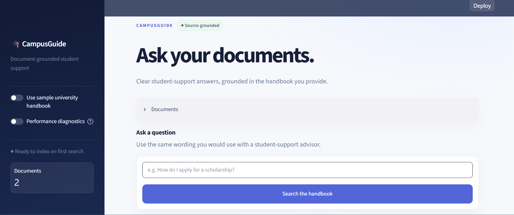
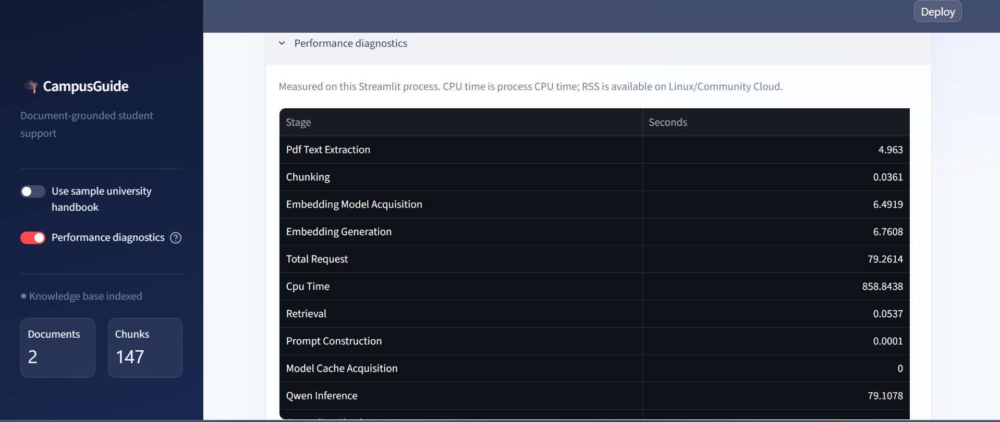

# 🎓 CampusGuide — AI-Based Chatbot for Student Services

[](https://es1307-ai-based-chatbot-for-student-services-app-s4xslw.streamlit.app/)


> IBM Project-Based Experiential Learning (PBEL) 2026

CampusGuide is a document-grounded Retrieval-Augmented Generation (RAG) application for student-support information. Students can upload university PDFs or text documents, ask a question in natural language, and inspect the exact passages used to answer it.

**[Open the live Streamlit application](https://es1307-ai-based-chatbot-for-student-services-app-u8xe19.streamlit.app/)**

## Features

- Upload one or more PDF or TXT university documents.
- Use the included sample university handbook without uploading a file.
- Search documents with semantic retrieval plus IDF-aware keyword ranking.
- Generate a clear answer with `Qwen/Qwen2.5-0.5B-Instruct`.
- Keep answers grounded: unsupported questions are declined instead of answered from general model knowledge.
- View the retrieved source chunks and relevance scores for each answer.
- Fall back to an extractive, source-only answer if Qwen is unavailable or fails grounding checks.
- Reuse cached document indexes and model instances for faster repeat searches.
- Enable optional performance diagnostics for timings, prompt size, selected chunks, CPU data, and Linux RSS memory.

## Architecture

```text
PDF / TXT documents
        │
        ▼
Text extraction (pypdf) and sentence-aware chunking
        │
        ▼
Cached MiniLM embeddings ──► in-memory NumPy vector index
                                      │
Student question ─► query embedding + IDF-aware ranking
                                      │
                                      ▼
                     Focused source context (best passage + continuation)
                                      │
                                      ▼
                     Qwen 2.5 0.5B Instruct (CPU)
                                      │
                                      ▼
                    Grounding validation against cached source vectors
                                      │
                                      ▼
                 Response, evidence expanders, and optional diagnostics
```

## RAG workflow

1. The user selects the sample handbook and/or uploads PDF or TXT documents.
2. The app extracts text, creates sentence-aware chunks, and creates MiniLM embeddings once per document set.
3. A question is embedded and ranked against the in-memory document vectors using semantic similarity and IDF-weighted lexical relevance.
4. CampusGuide selects the strongest evidence section and, when useful, its continuation rather than sending a large set of loosely related chunks to the LLM.
5. Qwen writes an answer using only the selected source context.
6. A lexical and semantic grounding check validates the generated answer. If the check fails, the app displays a source-only fallback or a safe “not found” response.
7. The response and its evidence are shown in the Streamlit interface.

## Tech stack

| Area | Technology |
| --- | --- |
| Language | Python 3.14 |
| UI and deployment | Streamlit Community Cloud |
| Generation model | `Qwen/Qwen2.5-0.5B-Instruct` |
| Embedding model | `sentence-transformers/all-MiniLM-L6-v2` |
| Retrieval | Normalized vector similarity with IDF-aware lexical scoring |
| Vector operations | NumPy |
| PDF extraction | pypdf |
| Model runtime | Transformers and PyTorch |

## Performance design

The application is tuned for CPU-only Streamlit Community Cloud deployment.

- MiniLM, Qwen, and document indexes use `st.cache_resource` so they are not recreated on ordinary Streamlit reruns.
- Uploads are persisted once per browser session; extraction, chunking, and embedding only repeat when the document set changes.
- Chunks use a 180-word size and 24-word overlap, which fits the embedding model more reliably than the previous larger chunks.
- Retrieval evaluates six candidates, then sends a focused 2–4 source window to Qwen with a 720-word context budget.
- Qwen is lazy-loaded only when a supported question needs generation. The landing page stays responsive after a cold restart.
- The source-grounding check compares a generated response with already cached source vectors instead of embedding the full source context again.

See [PERFORMANCE_REPORT.md](PERFORMANCE_REPORT.md) for the profiling method and measured before/after results.

## Project structure

```text
AI-Based-Chatbot-for-Student-Services/
├── app.py                         # Streamlit interface and session/caching flow
├── rag_engine.py                  # Extraction, indexing, retrieval, generation, grounding
├── requirements.txt               # Runtime dependencies
├── runtime.txt                    # Python version for Streamlit Community Cloud
├── README.md
├── PERFORMANCE_REPORT.md
├── .gitignore
├── .devcontainer/
│   └── devcontainer.json
├── images/                        # README screenshots
└── sample_documents/
    ├── northstar_university_handbook.txt
    ├── Student-Manual-SRMS-CET-CETR.pdf
    └── B.Tech. Ist Year Common AICTE Model Curriculum 2020-21 25082021.pdf
```

## Run locally

### Prerequisites

- Python 3.14
- Internet access on the first run so Hugging Face can download the model files

### Installation

```bash
git clone https://github.com/ES1307/AI-Based-Chatbot-for-Student-Services.git
cd AI-Based-Chatbot-for-Student-Services

python -m venv .venv
```

Activate the environment:

```bash
# Windows PowerShell
.venv\Scripts\Activate.ps1

# macOS / Linux
source .venv/bin/activate
```

Install dependencies and run the app:

```bash
pip install -r requirements.txt
streamlit run app.py
```

Open the local URL shown by Streamlit, normally `http://localhost:8501`.

### Model setting

The default generation model is `Qwen/Qwen2.5-0.5B-Instruct`. On a host that supports environment variables, it can be overridden before starting Streamlit:

```bash
# PowerShell example
$env:CAMPUSGUIDE_GENERATION_MODEL = "Qwen/Qwen2.5-0.5B-Instruct"
streamlit run app.py
```

Larger Qwen variants require more RAM and CPU time and are not recommended for Streamlit Community Cloud.

## Deploy on Streamlit Community Cloud

1. Push this repository to GitHub.
2. In Streamlit Community Cloud, create a new app from the repository.
3. Select `app.py` as the main file.
4. Deploy. Community Cloud uses `runtime.txt` and `requirements.txt` automatically.
5. The first model-backed question after a cold restart takes longer because Qwen must load; later searches reuse the cached model within that app process.

The currently deployed application is available at:

**https://es1307-ai-based-chatbot-for-student-services-app-s4xslw.streamlit.app/**

## Performance diagnostics

Turn on **Performance diagnostics** in the sidebar after deployment or during local development. It is off by default and shows:

- document extraction, chunking, embedding, and indexing time;
- retrieval, prompt construction, model acquisition, Qwen inference, grounding, and response-rendering time;
- total request and Streamlit script time;
- prompt word/token estimate and retrieved chunk count;
- process CPU data; and
- RSS memory on Linux, including Streamlit Community Cloud.

## Example questions

- What support is available for mental wellbeing?
- How do I request financial assistance?
- What is the attendance requirement?
- What are the college timings?
- What does the handbook say about scholarships?
- What facilities are available in the hostel?

## Screenshots

| Home | Answer generation |
| --- | --- |
|  |  |

| Retrieval context | Source evidence |
| --- | --- |
|  |  |

| Chat interface | Performance diagnostics |
| --- | --- |
|  |  |

## Learning outcomes

- Building an end-to-end RAG pipeline.
- Embedding-based semantic retrieval and lightweight hybrid ranking.
- Local LLM inference with constrained, document-grounded prompting.
- Explainable AI through visible source evidence.
- Streamlit caching, performance profiling, and cloud deployment.

## Future improvements

- OCR support for scanned PDFs.
- Persistent vector storage for larger, long-lived document collections.
- Conversation memory with source-grounding safeguards.
- Multilingual document and question support.
- Authentication and role-based document access.
- Source citations that link directly to a PDF page.

## Disclaimer

CampusGuide is an informational assistant. It only answers from selected document evidence and is not an official university decision-maker. Always verify deadlines, eligibility, fees, and emergency guidance with the university.

## Author

**Eshaan Sabharwal**<br>
B.Tech — Computer Science & Engineering<br>
Shri Ram Murti Smarak College of Engineering & Technology<br>
IBM Project-Based Experiential Learning (PBEL)

If this project helps you, consider giving the repository a star.
